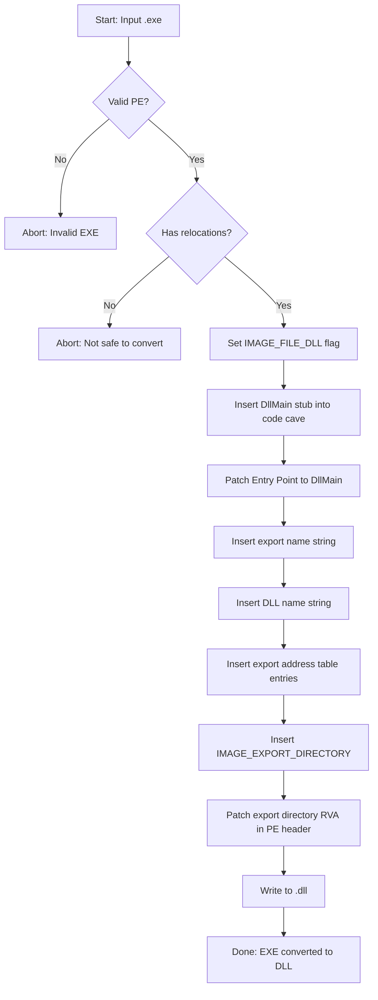
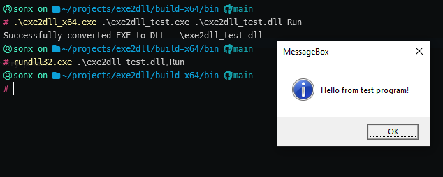
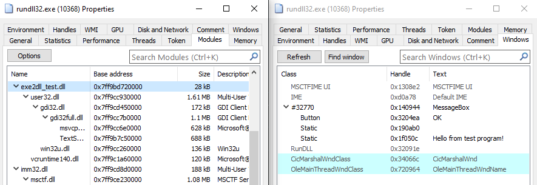
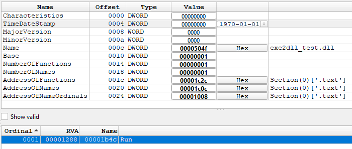

# exe2dll

A utility for converting Windows PE executables (`.exe`) into dynamic-link libraries (`.dll`) by patching PE headers and injecting export directories.

## Overview

exe2dll enables EXE files to be loaded and invoked as DLLs by:
- Patching PE headers to set DLL flags
- Injecting a DllMain stub and export directory
- Preserving the original entry point as an exported function
- Utilizing existing code caves (no section additions)

## Prerequisites

- Windows PE executable with `.reloc` section
- [peforge](https://github.com/scrymastic/peforge) library for PE manipulation

## Installation

```bash
git clone --recurse-submodules https://github.com/scrymastic/exe2dll.git
build.bat
```

## Usage

```bash
exe2dll.exe <input_exe> <output_dll> <exported_function_name>
```

Example:
```bash
exe2dll.exe test.exe test.dll Run
```
This creates `test.dll` with an exported `Run()` function that points to `test.exe`'s original entry point.

## Technical Details

### Conversion Process


### Example Output

Original EXE:


Converted DLL:


DLL Loading:


Export Table:


## License

See [LICENSE](LICENSE) file for details.
